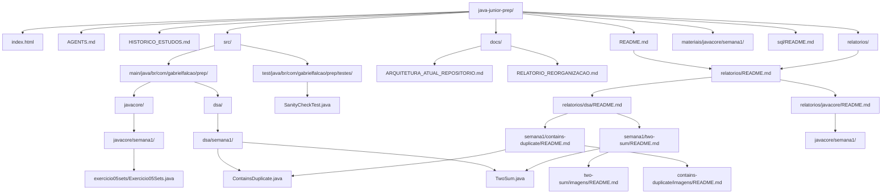

# Arquitetura atual do repositório Java Junior Prep

Diagnóstico de 11/09/2026, atualizado após a criação da central hierárquica de documentação. Caminhos relativos à raiz `C:/Projetos/java-junior-prep`, salvo indicação contrária. Este documento descreve os arquivos locais, inclusive as alterações do estudante ainda não commitadas. Existência de código não comprova conclusão pedagógica.

## 1. Visão geral

Repositório pessoal de Gabriel Falcão da Cruz para preparação para entrevistas e testes técnicos de Desenvolvedor Java Júnior. O método combina Active Recall, prática e explicação Feynman em um plano geral de 12 semanas.

O `pom.xml` confirma um único projeto Maven, coordenadas `br.com.gabrielfalcao:java-junior-prep:1.0-SNAPSHOT`, codificação UTF-8 e source/target Java 17. Isso confirma a configuração do projeto, não a versão da JVM instalada.

As trilhas de código são Java Core e DSA em `src/main/java`; os testes ficam em `src/test/java`. SQL tem diretório próprio, por enquanto somente com README. Materiais teóricos e relatórios são separados por trilha e semana. Há arquivos de Java Core nas semanas 1 e 2, DSA nas semanas 1 e 4 e uma reserva de testes na semana 2; não há implementação para todas as semanas.

O calendário `index.html` inclui Java Core (seis semanas), DSA, Testes, SQL, Inglês e Storytelling. Ele é uma interface HTML/JavaScript independente do Maven, com progresso no localStorage e chamadas a `/api/progress`. Não foi encontrada implementação dessa API no repositório. O progresso armazenado no navegador não foi inspecionado: a data de hoje não determina automaticamente a semana de estudo.

A navegação documental agora parte do [README principal](../README.md), segue para a [central geral](../relatorios/README.md), os índices de [DSA](../relatorios/dsa/README.md) e [Java Core](../relatorios/javacore/README.md), e então para os relatórios individuais. Código, materiais teóricos, histórico e arquitetura mantêm suas responsabilidades anteriores.

## 2. Árvore real de diretórios

**ARQUITETURA EXISTENTE**

Árvore dos arquivos relevantes conferida no disco. Caminhos intermediários foram compactados com barras para facilitar a leitura. Inclui os índices, as pastas individuais e as evidências reais de Contains Duplicate e Two Sum.

```text
java-junior-prep/
├── .gitignore
├── AGENTS.md
├── HISTORICO_ESTUDOS.md
├── README.md
├── index.html
├── pom.xml
├── docs/
│   ├── ARQUITETURA_ATUAL_REPOSITORIO.md
│   ├── ARQUITETURA_REPOSITORIO_ANTES_DA_REORGANIZACAO.md
│   └── RELATORIO_REORGANIZACAO.md
├── materiais/javacore/semana1/
│   ├── colecoes_java_pdf.html
│   ├── guia-completo-string-pool-java17.html
│   └── guia-completo-string-pool-java17.pdf
├── relatorios/
│   ├── README.md
│   ├── dsa/
│   │   ├── README.md
│   │   └── semana1/
│   │       ├── two-sum/
│   │       │   ├── README.md
│   │       │   └── imagens/
│   │       │       ├── README.md
│   │       │       ├── teste-01-caso-comum.png
│   │       │       ├── teste-02-par-no-meio.png
│   │       │       ├── teste-03-valores-repetidos.png
│   │       │       ├── teste-04-numeros-negativos.png
│   │       │       ├── teste-05-zeros-repetidos.png
│   │       │       └── teste-06-sem-solucao.png
│   │       └── contains-duplicate/
│   │           ├── README.md
│   │           └── imagens/
│   │               ├── README.md
│   │               ├── teste-01-duplicata-final.png
│   │               ├── teste-02-sem-duplicata.png
│   │               ├── teste-03-duplicata-consecutiva.png
│   │               ├── teste-04-numero-negativo.png
│   │               ├── teste-05-elemento-unico.png
│   │               └── teste-06-array-vazio.png
│   └── javacore/
│       ├── README.md
│       └── semana1/
│           ├── laboratorio-01-igualdade-referencias.html
│           └── laboratorio-01-igualdade-referencias.pdf
├── sql/
│   └── README.md
└── src/
    ├── main/java/br/com/gabrielfalcao/prep/
    │   ├── dsa/
    │   │   ├── semana1/
    │   │   │   ├── ContainsDuplicate.java
    │   │   │   └── TwoSum.java
    │   │   └── semana4/
    │   │       └── ValidParentheses.java
    │   └── javacore/
    │       ├── semana1/
    │       │   ├── exercicio01igualdadedereferencias/
    │       │   │   ├── Exercicio01IgualdadeDeReferencias.java
    │       │   │   └── Produto.java
    │       │   ├── exercicio02stringpool/Exercicio02StringPool.java
    │       │   ├── exercicio03equalsehashcode/Exercicio03EqualsEHashCode.java
    │       │   ├── exercicio04listas/Exercicio04Listas.java
    │       │   ├── exercicio05sets/Exercicio05Sets.java
    │       │   └── exercicio06maps/Exercicio06Maps.java
    │       └── semana2/StreamsExemplo.java
    └── test/java/br/com/gabrielfalcao/prep/testes/
        ├── SanityCheckTest.java
        └── semana2/SafeWalletServiceTest.java
```

Os PDFs listados são documentos existentes e não foram usados como evidência. Os PNGs das pastas individuais de Contains Duplicate e Two Sum são as evidências visuais conferidas dos testes manuais.

## 3. Desenho visual da arquitetura

Os nós representam somente caminhos existentes; as setas mostram organização dos arquivos e navegação da central até documentação, código e orientação de imagens.



Os rótulos sob o pacote-base explicitam a trilha para diferenciar semanas homônimas; não representam duplicação de diretórios.

## 4. Responsabilidade dos diretórios

| Caminho | Responsabilidade | Conteúdo encontrado |
| ------- | ---------------- | ------------------- |
| Raiz | Orientação, calendário e build | AGENTS, README, histórico, index.html, pom.xml e .gitignore |
| `docs/` | Arquitetura e registro da reorganização | Fotografia anterior, relatório de reorganização e arquitetura atual |
| `materiais/javacore/semana1/` | Teoria para consulta | Guia de coleções HTML e guia de String Pool HTML/PDF |
| `relatorios/` | Central de documentação | README geral, índices DSA e Java Core |
| `relatorios/dsa/semana1/` | Registro individual de prática DSA | two-sum/README.md com roteiro preservado e contains-duplicate/README.md Em validação |
| `relatorios/dsa/semana1/two-sum/imagens/` | Reunir evidências de Two Sum | README e seis PNGs de execuções manuais, incluídos e conferidos |
| `relatorios/dsa/semana1/contains-duplicate/imagens/` | Reunir evidências de Contains Duplicate | README e seis PNGs de execuções manuais, incluídos e conferidos |
| `relatorios/javacore/semana1/` | Relato de aprendizagem Java Core | Laboratório 01 em HTML/PDF |
| `src/main/java/br/com/gabrielfalcao/prep/javacore/` | Fundamentos da linguagem e APIs | Seis exercícios na semana 1, Produto e reserva Streams na semana 2 |
| `src/main/java/br/com/gabrielfalcao/prep/dsa/` | Problemas algorítmicos | Two Sum, Contains Duplicate e reserva Valid Parentheses |
| `src/test/java/br/com/gabrielfalcao/prep/testes/` | Testes automatizados e trilha de testes | SanityCheckTest e reserva SafeWalletServiceTest |
| `sql/` | Área separada para SQL | README de orientação; nenhum script |

## 5. Organização dos pacotes Java

Pacote-base: `br.com.gabrielfalcao.prep`. São 13 arquivos Java: 11 em main e dois em test. Os packages lidos correspondem aos diretórios. Pacotes usam minúsculas; classes declaradas usam PascalCase e correspondem aos nomes dos arquivos.

| Pacote relativo ao pacote-base | Classes/conteúdo encontrado |
| --- | --- |
| `dsa.semana1` | ContainsDuplicate e TwoSum implementados |
| `dsa.semana4` | ValidParentheses.java: apenas package e TODO, sem classe |
| `javacore.semana1.exercicio01igualdadedereferencias` | Exercicio01IgualdadeDeReferencias e Produto |
| `javacore.semana1.exercicio02stringpool` | Exercicio02StringPool: classe vazia com enunciado |
| `javacore.semana1.exercicio03equalsehashcode` | Exercicio03EqualsEHashCode: classe vazia com enunciado |
| `javacore.semana1.exercicio04listas` | Exercicio04Listas: classe vazia com enunciado |
| `javacore.semana1.exercicio05sets` | Exercicio05Sets: main com HashSet e anotações |
| `javacore.semana1.exercicio06maps` | Exercicio06Maps: classe vazia com enunciado |
| `javacore.semana2` | StreamsExemplo.java: package e TODO, sem classe |
| `testes` | SanityCheckTest, geral e sem semana |
| `testes.semana2` | SafeWalletServiceTest.java: package e TODO, sem classe |

Java Core usa subpacotes numerados por exercício; DSA usa diretamente a semana e o nome do desafio. Essa diferença reflete responsabilidades distintas, sem necessidade de uniformização nesta tarefa.

Inconsistências identificadas, sem correção:

- O exercício 01 tem enunciado restrito a referências e proíbe equals, mas seu main contém Strings, equals, HashSet de Produto e listas. Comentários ainda citam Pessoa, ausente dos fontes atuais.
- Produto possui id, nome e construtor, mas não sobrescreve equals/hashCode. O comentário que prevê igualdade lógica entre p1 e p2 não corresponde a essa classe; hashes de objetos diferentes também não são necessariamente distintos.
- O exercício 05 pede comparação entre HashSet, LinkedHashSet e TreeSet, mas somente HashSet está implementado. Isso indica prática parcial do enunciado, não conclusão do laboratório.
- Nomes de arquivos reservados não significam classes implementadas.
- Tópico 1.3 de Java Core pertence à semana 2 no calendário; o número do tópico não equivale à semana. A existência de StreamsExemplo não comprova início do estudo.

## 6. Desafios de DSA

Na tabela, os caminhos Java são relativos a `src/main/java/br/com/gabrielfalcao/prep/`.

| Desafio | Arquivo Java | Semana | Estado aparente | Testes | Documentação |
| ------- | ------------ | -----: | --------------- | ------ | ------------ |
| Two Sum | `dsa/semana1/TwoSum.java` | 1 | Busca complemento com HashMap e retorna índices; array vazio se não encontrar. Concluído segundo Gabriel em 11/09/2026, não inferido da existência do fonte | seis casos manuais documentados e aprovados; nenhum teste automatizado específico | `relatorios/dsa/semana1/two-sum/README.md`: roteiro e duas tentativas preservados, com seis evidências adicionadas posteriormente |
| Contains Duplicate | `dsa/semana1/ContainsDuplicate.java` | 1 | HashSet com consulta antes de inserção; implementado e em validação, não concluído | seis casos manuais documentados e aprovados; nenhum teste automatizado específico | `relatorios/dsa/semana1/contains-duplicate/README.md`: estratégia, fluxo, seis testes com evidências, complexidade e pendência Feynman |
| Valid Parentheses | `dsa/semana4/ValidParentheses.java` | 4 | Somente package e TODO; sem algoritmo ou classe | Sem main e sem teste específico | Nenhum documento individual encontrado |

O calendário situa Two Sum e Contains Duplicate em DSA 2.1 — HashMap/HashSet aplicado a problemas, com DSA 2.2 — Big O na prática após cada problema. O texto de Two Sum no calendário fala em guardar o complemento; o fonte guarda o valor e procura o complemento. Não é a mesma descrição literal, embora a estratégia implementada seja coerente com o problema.

## 7. Situação atual do Contains Duplicate

- **Caminho:** `src/main/java/br/com/gabrielfalcao/prep/dsa/semana1/ContainsDuplicate.java`.
- **Package:** `br.com.gabrielfalcao.prep.dsa.semana1`.
- **Assinatura:** `public boolean containsDuplicate(int[] nums)`.
- **Teste local:** possui `public static void main(String[] args)`, que instancia ContainsDuplicate, chama o método e imprime o resultado.
- **Entrada salva no código:** somente `int[] nums = {1, 2, 3, 2};`.
- **Estratégia:** `Set<Integer> numerosObservados = new HashSet<>();`, percurso por índice, consulta `numerosObservados.contains(nums[i])` antes de `numerosObservados.add(nums[i])`.
- **Retornos:** true na primeira repetição, antes de adicionar novamente; false ao terminar o percurso sem repetição.
- **Impressões:** o estado do conjunto é mostrado uma vez no caminho de retorno, não em cada iteração. A ordem dos elementos impressos não é garantida pelo HashSet.

Mensagens literais presentes:

```text
HashSet:
Número duplicado encontrado:
Nenhum número duplicado foi encontrado.
Resultado:
```

As duas primeiras recebem, respectivamente, o conjunto e o número; a última recebe o booleano no main. Os prefixos acima não são transcrição de uma execução nesta tarefa.

| Entrada | Situação em 11/09/2026 | Resultado |
| --- | --- | --- |
| [1, 2, 3, 2] | Execução manual com evidência visual | true, aprovado |
| [1, 2, 3, 4] | Execução manual com evidência visual | false, aprovado |
| [5, 5, 8, 9] | Execução manual com evidência visual | true, aprovado |
| [-1, 2, 3, -1] | Execução manual com evidência visual | true, aprovado |
| [7] | Execução manual com evidência visual | false, aprovado |
| [] | Execução manual com evidência visual; caso local adicional de robustez | false, aprovado |

Existe [README individual](../relatorios/dsa/semana1/contains-duplicate/README.md), com [índice de imagens](../relatorios/dsa/semana1/contains-duplicate/imagens/README.md). As seis capturas estão legíveis e registram o estado do HashSet, a mensagem sobre duplicação, a entrada utilizada e o resultado final. Não há teste automatizado específico.

Arquivos de evidência: `teste-01-duplicata-final.png`, `teste-02-sem-duplicata.png`, `teste-03-duplicata-consecutiva.png`, `teste-04-numero-negativo.png`, `teste-05-elemento-unico.png` e `teste-06-array-vazio.png`. O padrão utilizado é `teste-NN-cenario.png`, com links relativos no README individual e no índice da pasta.

O custo esperado da estratégia é tempo médio O(n) e espaço adicional O(n), com operações de HashSet O(1) em média. Contains Duplicate permanece **Em validação**: os seis testes manuais e suas evidências estão documentados, mas ainda faltam a explicação Feynman por Gabriel, a justificativa oral de Big O e a revisão final antes de qualquer commit aprovado.

## 8. Documentação atual

| Documento | Finalidade e limites |
| --- | --- |
| `README.md` | Entrada do projeto, execução, responsabilidades, árvore e acesso à central; Contains Duplicate consta como implementado e Em validação |
| `index.html` | Calendário e hub de progresso; fonte de verdade de trilhas, tópicos e semanas, não prova de progresso pessoal salvo no navegador |
| `AGENTS.md` | Método pedagógico, separação das trilhas, regras de colaboração e critérios de conclusão |
| `HISTORICO_ESTUDOS.md` | Único histórico geral encontrado; continuidade, registros de 12/08 e atualização de 11/09/2026 nesta tarefa |
| `docs/ARQUITETURA_REPOSITORIO_ANTES_DA_REORGANIZACAO.md` | Fotografia histórica anterior, com caminhos e problemas que não representam necessariamente o estado atual |
| `docs/RELATORIO_REORGANIZACAO.md` | Registro de 05/09/2026 das movimentações, preservação e validações anteriores; não é segundo histórico geral de estudos |
| `docs/ARQUITETURA_ATUAL_REPOSITORIO.md` | Este diagnóstico, com central implementada e pendências futuras separadas |
| `relatorios/README.md` | Central geral, responsabilidades, trilhas e legenda de status |
| `relatorios/dsa/README.md` | Índice por semana, status e links aos desafios e código |
| `relatorios/javacore/README.md` | Índice dos relatórios existentes e arquivos ainda sem relatório |
| `relatorios/dsa/semana1/contains-duplicate/README.md` | Documentação individual Em validação; seis casos manuais aprovados e Feynman pendente |
| `relatorios/dsa/semana1/contains-duplicate/imagens/README.md` | Índice dos seis PNGs existentes, com entradas e resultados observados |
| `relatorios/dsa/semana1/two-sum/imagens/README.md` | Índice dos seis PNGs existentes, com entradas, targets e resultados observados |
| `relatorios/dsa/semana1/two-sum/README.md` | Documento individual de Two Sum: entendimento, plano, pseudocódigo e duas tentativas preservadas; seis evidências manuais acrescentadas sem preencher retroativamente os campos históricos |
| `relatorios/javacore/semana1/laboratorio-01-igualdade-referencias.html` | Relato do estágio com Pessoa e pendência sobre null; não descreve o main atual com Produto |
| `relatorios/javacore/semana1/laboratorio-01-igualdade-referencias.pdf` | Documento PDF homônimo do laboratório; equivalência com HTML não revalidada |
| `materiais/javacore/semana1/colecoes_java_pdf.html` | Material teórico de coleções em HTML, apesar do nome conter pdf |
| `materiais/javacore/semana1/guia-completo-string-pool-java17.html` | Material teórico de String Pool |
| `materiais/javacore/semana1/guia-completo-string-pool-java17.pdf` | PDF homônimo do guia; não comprova quanto foi estudado |
| `sql/README.md` | Orienta a criação gradual de exercícios SQL; nenhum script presente |

Não há duplicidade de históricos gerais. Relatórios individuais registram aprendizagem de um exercício; o relatório de reorganização registra uma intervenção estrutural. Os registros antigos com Pessoa foram preservados no histórico, sem fingir que Pessoa.java existe hoje.

O histórico antigo mantinha a retomada em igualdade/null e descrevia a estrutura inicialmente vazia. O relato atual avança para Set/HashSet e Contains Duplicate. Não há evidência suficiente para encerrar automaticamente todas as pendências antigas de Java Core. A conclusão informada de Two Sum também não preenche retroativamente os campos do relatório.

## 9. Testes e validação

`src/test/java` existe. O POM declara JUnit Jupiter 5.10.0, Mockito Core 5.5.0 e Mockito JUnit Jupiter 5.5.0, todos com escopo test. Não há uso de Mockito nos fontes lidos.

Há **um método de teste implementado**: `br.com.gabrielfalcao.prep.testes.SanityCheckTest.testMath()`, anotado com `@Test`, que verifica 2 + 2 = 4. SafeWalletServiceTest.java tem apenas package e TODO: não conta como teste executável. Quantidade de testes automatizados específicos de Two Sum e Contains Duplicate: **zero**.

Os desafios implementados oferecem somente main para validação local. Também há main nos exercícios Java Core 01 e 05. Nenhum deles recebe cobertura do teste aritmético.

O relatório de reorganização registra execução anterior de um teste sem falhas e do main de Two Sum com `Resultado: [1, 4]`. Esses são resultados históricos de 05/09/2026, não validação desta tarefa.

No diagnóstico documental anterior de 11/09/2026, restrito a dois Markdown, não foram executados Maven nem os mains: houve leitura estática e conferência documental. Na implementação da central, Maven passou a integrar a validação solicitada; seus resultados estão registrados abaixo. Depois desse diagnóstico, Gabriel executou os seis casos manuais de Contains Duplicate e adicionou as evidências visuais. Não foram criados testes automatizados específicos.

## 10. Git e arquivos ignorados

### Validação da central em 11/09/2026

- `mvn compile '-Dmaven.repo.local=.m2/repository'`: BUILD SUCCESS, saída 0; 11 fontes principais compilados.
- `mvn test '-Dmaven.repo.local=.m2/repository'`: BUILD SUCCESS, saída 0; um teste executado, zero falhas, erros ou ignorados (SanityCheckTest.testMath).
- O parâmetro de repositório local manteve o cache dentro do workspace, sem alterar o POM. Permaneceu o aviso sobre source/target 17 recomendando --release 17; não se afirma execução em JVM 17 nativa nem compatibilidade de APIs verificada por --release nesta execução.
- Os 13 arquivos Java mantiveram seus hashes SHA-256; pom.xml, index.html, .gitignore, testes, materiais e relatórios HTML/PDF também foram preservados.
- Foram conferidos 72 links relativos para arquivos/diretórios, sem destinos ausentes. As referências antigas de Two Sum remanescentes são históricas e têm nota com o caminho atual.
- O corpo original de Two Sum, do enunciado até a última tentativa, foi preservado integralmente no novo README. O arquivo antigo não ficou duplicado. Registros cronológicos anteriores do histórico foram preservados.
- Os seis PNGs produzidos por Gabriel foram encontrados e conferidos posteriormente. Contains Duplicate permanece Em validação por causa das pendências pedagógicas.
- `git diff --check` e `git diff --cached --check`: sem erros de whitespace; somente avisos de conversão futura LF/CRLF no diff de trabalho.

Branch inicial: `chore/reorganiza-arquitetura`.

Estado inicial do diagnóstico anterior (antes de criar este documento e atualizar o histórico):

```text
 M src/main/java/br/com/gabrielfalcao/prep/dsa/semana1/ContainsDuplicate.java
 M src/main/java/br/com/gabrielfalcao/prep/javacore/semana1/exercicio05sets/Exercicio05Sets.java
```

As duas modificações são preexistentes, fora do índice, e foram preservadas. O diagnóstico considera seu conteúdo local. Não havia alteração do histórico nem documento de arquitetura atual no estado inicial.

O .gitignore contém `target/`, `.m2/`, `.idea/`, `.vscode/`, `*.iml`, `.DS_Store`, `Thumbs.db` e `*.log`. As pastas locais .m2 e target existem e `git check-ignore` confirma que são ignoradas. A inspeção dos nomes de `git ls-files` não encontrou arquivos rastreados de build, cache ou dependências; seus conteúdos internos não foram usados para compor a arquitetura.

As contagens de 590 arquivos em .m2 e 12 em target no documento anterior são históricas. Não representam o índice atual. O grande estado Git transcrito no relatório de reorganização também é histórico e não deve ser copiado como diagnóstico de hoje.

No diagnóstico anterior, somente o histórico e a arquitetura foram criados/atualizados, sem staging, commit ou push. A implementação da central começou depois, na mesma branch, com:

```text
 M HISTORICO_ESTUDOS.md
 M src/main/java/br/com/gabrielfalcao/prep/dsa/semana1/ContainsDuplicate.java
 M src/main/java/br/com/gabrielfalcao/prep/javacore/semana1/exercicio05sets/Exercicio05Sets.java
?? docs/ARQUITETURA_ATUAL_REPOSITORIO.md
```

Essas alterações foram preservadas. A central acrescentou índices, documentação e orientações de imagens. O relatório de Two Sum foi movido com `git mv`, que registra a movimentação no índice; as adições ao README movido permanecem como edições posteriores no disco. Não houve commit ou push. Os 13 hashes Java foram registrados antes das alterações para comparação final.

## 11. Documentação individual implementada

A proposta do diagnóstico anterior foi aprovada pelo estudante e implementada em 11/09/2026. O padrão é `relatorios/<trilha>/semanaN/<desafio>/README.md`, com `imagens/README.md` para orientar as evidências reais. A árvore existente da seção 2 já inclui essas pastas; elas não são mais proposta.

Two Sum foi movido de `relatorios/dsa/semana1/two-sum.md` para [relatorios/dsa/semana1/two-sum/README.md](../relatorios/dsa/semana1/two-sum/README.md). O nome antigo nesta frase é histórico. Todas as tentativas, respostas, observações e campos pendentes foram mantidos; somente navegação, acesso ao código e seção de evidências foram acrescentados. Os trechos Java antigos do apêndice são preservação histórica, não uma segunda implementação oficial.

O [README de Contains Duplicate](../relatorios/dsa/semana1/contains-duplicate/README.md) contém:

1. enunciado e informações do desafio;
2. síntese da compreensão registrada pelo estudante;
3. estratégia e motivo da escolha do HashSet;
4. fluxo: receber array, consultar, retornar true se repetido, adicionar se novo e retornar false ao terminar;
5. link relativo para o fonte canônico, sem copiar a classe;
6. tabela de testes com entradas, resultados esperados, relatos de resultados e pendências;
7. espaços de evidências com legendas; imagens e links aos PNGs somente depois da inclusão real;
8. complexidade média de tempo e espaço no nível de entrevista Júnior;
9. espaço pendente para Feynman: problema, conceito, escolha, alternativa e custos, a ser preenchido pelo estudante;
10. aprendizados, correções e pontos para revisão.

Os arquivos de Contains Duplicate são `teste-01-duplicata-final.png`, `teste-02-sem-duplicata.png`, `teste-03-duplicata-consecutiva.png`, `teste-04-numero-negativo.png`, `teste-05-elemento-unico.png` e `teste-06-array-vazio.png`. Os seis existem, foram conferidos e estão documentados no README de imagens. Essa numeração cobre todos os casos manuais registrados.

Two Sum utiliza o padrão `teste-NN-cenario.png`. Seus arquivos são `teste-01-caso-comum.png`, `teste-02-par-no-meio.png`, `teste-03-valores-repetidos.png`, `teste-04-numeros-negativos.png`, `teste-05-zeros-repetidos.png` e `teste-06-sem-solucao.png`. Os seis existem, foram conferidos e estão vinculados por caminhos relativos. Os relatórios HTML/PDF de Java Core foram preservados em seus caminhos anteriores.

## 12. Arquitetura existente versus pendências futuras

| Aspecto | Situação atual | Pendência futura | Justificativa |
| ------- | -------------- | --------------- | ------------- |
| Código | Java oficial preservado em src/; README individual aponta para ele | Nenhuma alteração Java nesta tarefa | Evitar duplicar ou substituir a implementação |
| Central | README principal → central → trilha → desafio | Manter os índices conforme novos estudos reais | Facilitar navegação |
| Documentação individual | Two Sum com histórico preservado e seis evidências; Contains Duplicate com seis resultados e evidências | Registrar Feynman de Contains Duplicate | Estrutura e testes não significam conclusão pedagógica |
| Imagens | Seis PNGs de cada desafio vinculados por caminhos relativos | Preservar as evidências reais | Manter rastreabilidade das execuções manuais |
| Testes DSA | Seis casos manuais de cada desafio; sem JUnit específico | Avaliar JUnit no momento autorizado | Consolidar prática sem antecipar trilha |
| Big O | Justificativa curta documentada para Contains Duplicate | Gabriel revisar e explicar os custos | Demonstrar aprendizagem |
| Documentos gerais | Histórico na raiz, teoria em materiais e arquitetura em docs | Preservar finalidade e continuidade | Separar responsabilidades |

Não restam pastas propostas a criar para os dois desafios desta tarefa. As pendências são evidências, prática e revisão.

## 13. Pontos que dependem de decisão ou ação

- Gabriel realizar a explicação Feynman e justificar Big O com suas próprias palavras.
- Decidir se as impressões didáticas do código serão mantidas ou removidas, em uma alteração Java futura autorizada.
- Decidir quando incluir JUnit conforme calendário ou solicitação, mantendo main para a prática atual.
- Decidir posteriormente como atualizar os campos antigos do relatório Two Sum sem reiniciar um desafio informado como concluído.
- Confirmar o fechamento das pendências antigas de Java Core somente mediante aprendizagem demonstrada.
- Realizar revisão final e aprovar antes de preparar commit.

Local da documentação, subpasta de imagens, nomes de Contains Duplicate e português foram definidos pela solicitação desta central. Nenhum HTML/PDF, código ou material teórico foi movido.

## 14. Resumo para outro assistente

- **Código-fonte:** `src/main/java/br/com/gabrielfalcao/prep/`.
- **Contains Duplicate:** `src/main/java/br/com/gabrielfalcao/prep/dsa/semana1/ContainsDuplicate.java`, implementado com HashSet, em validação.
- **Two Sum:** `src/main/java/br/com/gabrielfalcao/prep/dsa/semana1/TwoSum.java`, implementado com HashMap; estudo concluído segundo Gabriel em 11/09/2026.
- **Java Core:** `src/main/java/br/com/gabrielfalcao/prep/javacore/semana1/`, especialmente `exercicio05sets/Exercicio05Sets.java`.
- **Histórico:** `HISTORICO_ESTUDOS.md`, na raiz, único histórico geral.
- **Relatórios de estudo:** `relatorios/dsa/semana1/` e `relatorios/javacore/semana1/`. Relatório de reorganização: `docs/RELATORIO_REORGANIZACAO.md`.
- **Imagens:** subpasta imagens/ por desafio com README; Contains Duplicate e Two Sum possuem seis PNGs cada no padrão teste-NN-cenario.png, todos conferidos e vinculados.
- **Documentação criada:** `relatorios/dsa/semana1/contains-duplicate/README.md`, com subpasta imagens/; central geral em `relatorios/README.md`.
- **Próximo passo:** Gabriel realizar a explicação Feynman, justificar Big O, decidir sobre os println didáticos e participar da revisão final. Contains Duplicate permanece Em validação.

Enviar ao outro assistente, para continuidade:

1. `AGENTS.md`, `index.html`, `README.md` e `HISTORICO_ESTUDOS.md`;
2. `docs/ARQUITETURA_ATUAL_REPOSITORIO.md` e `docs/RELATORIO_REORGANIZACAO.md`;
3. os fontes ContainsDuplicate.java, TwoSum.java e Exercicio05Sets.java nos caminhos acima;
4. `relatorios/dsa/semana1/two-sum/README.md`;
5. `pom.xml` e `src/test/java/br/com/gabrielfalcao/prep/testes/SanityCheckTest.java`, para explicitar a configuração e o limite da cobertura;
6. `relatorios/README.md`, os índices das trilhas e `relatorios/dsa/semana1/contains-duplicate/README.md` com seu README de imagens; prints somente depois de existirem.

A arquitetura anterior pode acompanhar o conjunto como contexto histórico, claramente identificada. Os registros antigos não autorizam mover arquivos nem antecipar tópicos.
