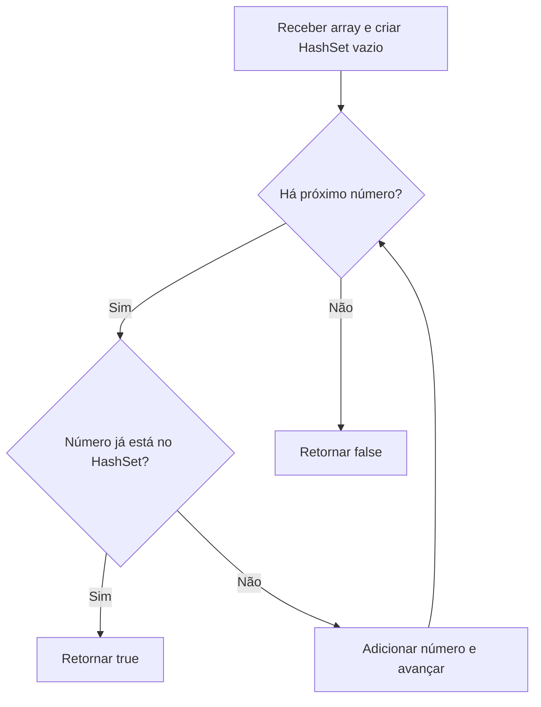

# Contains Duplicate

[ Voltar para a central de DSA](../../README.md)

## Informações do desafio

| Campo | Valor |
| --- | --- |
| Trilha | DSA |
| Semana | 1 |
| Estrutura principal | HashSet |
| Status | Em validação |
| Linguagem | Java |

Fontes: [histórico de estudos](../../../../HISTORICO_ESTUDOS.md), [arquitetura atual](../../../../docs/ARQUITETURA_ATUAL_REPOSITORIO.md) e código oficial. Os resultados manuais e as correções de tentativas foram informados por Gabriel em 11/09/2026; esta página não representa uma nova execução.

## Enunciado

O método recebe um array de inteiros e identifica se algum valor aparece mais de uma vez. Retorna `true` quando existe repetição e `false` quando todos os valores são diferentes.

## Compreensão do problema

Síntese da compreensão registrada por Gabriel, sem citação literal: receber os números, percorrer o array, guardar os números observados, verificar se algum se repete e devolver um booleano.

## Estratégia

A implementação atual segue estes passos:

1. criar um HashSet vazio;
2. percorrer o array;
3. consultar o número antes de adicioná-lo;
4. retornar `true` se ele já estiver presente;
5. adicionar se ainda não estiver;
6. retornar `false` depois do percurso completo.

## Fluxo visual

## Código-fonte

[Consultar ContainsDuplicate.java](../../../../src/main/java/br/com/gabrielfalcao/prep/dsa/semana1/ContainsDuplicate.java)

Assinatura: `public boolean containsDuplicate(int[] nums)`. O código oficial permanece somente em `src/`; esta página não mantém uma cópia da classe.

O main atual contém `{1, 2, 3, 2}`. As impressões mostram o HashSet no caminho de retorno, a repetição encontrada ou sua ausência e o resultado final. Não há impressão do conjunto em toda iteração.

## Testes

| Nº | Cenário | Entrada | Esperado | Obtido | Evidência |
| -: | ------------------------ | ---------------- | -------: | -----------------------------: | --------------------------------- |
| 1 | Duplicata no final | `[1, 2, 3, 2]` | `true` | `true`, informado por Gabriel | aguardando arquivo no repositório |
| 2 | Sem duplicata | `[1, 2, 3, 4]` | `false` | `false`, informado por Gabriel | aguardando arquivo no repositório |
| 3 | Duplicata consecutiva | `[5, 5, 8, 9]` | `true` | Pendente | Pendente |
| 4 | Número negativo repetido | `[-1, 2, 3, -1]` | `true` | Pendente | Pendente |
| 5 | Elemento único | `[7]` | `false` | Pendente | Pendente |
| 6 | Array vazio | `[]` | `false` | Pendente | Pendente |

Não existem testes automatizados específicos deste desafio. O SanityCheckTest geral não valida este algoritmo. Os dois primeiros resultados são relatos de execução manual; os quatro restantes continuam pendentes.

## Evidências visuais

[Orientações e nomes dos arquivos](imagens/README.md). Nenhum print foi encontrado no repositório. Gabriel informou que os dois primeiros já foram capturados; a inclusão dos arquivos ainda está pendente.

### Teste 01 — Duplicata no final

> Evidência pendente: inserir o print já capturado, conforme informado por Gabriel; o arquivo ainda não está no repositório.

### Teste 02 — Sem duplicata

> Evidência pendente: inserir o print já capturado, conforme informado por Gabriel; o arquivo ainda não está no repositório.

### Teste 03 — Duplicata consecutiva

> Evidência pendente: o print será adicionado depois da execução local.

### Teste 04 — Número negativo repetido

> Evidência pendente: o print será adicionado depois da execução local.

### Teste 05 — Elemento único

> Evidência pendente: o print será adicionado depois da execução local.

### Teste 06 — Array vazio

> Evidência pendente: o print será adicionado depois da execução local.

## Complexidade

- **Operações do HashSet: `O(1)` em média.** A consulta e a inserção normalmente não precisam percorrer todos os elementos do conjunto.
- **Percurso do array: `O(n)`.** No máximo, cada um dos n números é visitado uma vez; uma repetição pode encerrar o percurso antes.
- **Tempo médio total: `O(n)`.** Até n visitas, com consulta e inserção de custo médio constante por visita.
- **Espaço adicional: `O(n)`.** Quando todos são diferentes, o conjunto pode guardar os n números.

Essa justificativa acompanha o código; Gabriel ainda fará sua revisão de Big O no nível de entrevista Júnior.

## Explicação Feynman

> Pendente: Gabriel escreverá esta explicação com suas próprias palavras depois dos testes.

## Erros corrigidos e aprendizados

As duas correções de tentativas abaixo foram relatadas por Gabriel no histórico; o fonte atual confirma a ordem e os escopos resultantes.

- Verificar antes de adicionar. Adicionar antes de consultar faria o próprio número ser encontrado imediatamente.
- `nums` já é parâmetro e não deve ser redeclarado dentro do mesmo método. A variável de entrada do main pertence a outro método.
- O `main` é usado somente para testes locais; plataformas normalmente fornecem os valores por testes externos.
- `return true` encerra o método ao encontrar a primeira repetição.
- `return false` fica depois do laço, quando o percurso terminou sem encontrar repetição.

## Próximas etapas

1. executar os quatro casos pendentes;
2. salvar os seis prints, incluindo os dois já capturados segundo Gabriel;
3. atualizar os resultados e os vínculos das evidências reais;
4. escrever explicação Feynman;
5. revisar Big O;
6. remover ou manter as impressões didáticas do código mediante decisão de Gabriel;
7. realizar a revisão final;
8. preparar commit somente depois da aprovação.

Retomada imediata: inserir primeiro os dois prints já capturados, executar `{5, 5, 8, 9}` e salvar `teste-03-duplicata-consecutiva.png`. Nenhuma alteração Java foi feita para preparar esta documentação.
