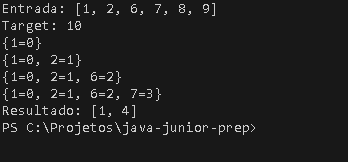
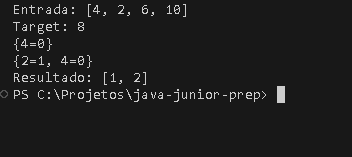
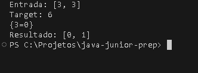
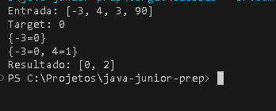
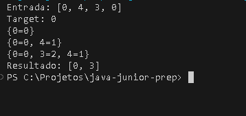
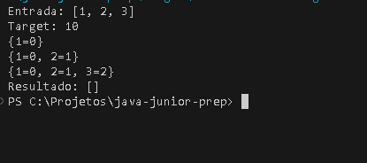

# Two Sum — DSA, semana 1

[Início](../../../../README.md) · [Central de estudos](../../../README.md) · [DSA](../../README.md) · [Evidências](imagens/)

## Acesso ao código-fonte

[Consultar TwoSum.java oficial](../../../../src/main/java/br/com/gabrielfalcao/prep/dsa/semana1/TwoSum.java)

**Status técnico:** Implementado e testado.

O código executável permanece em src/. As tentativas já presentes no apêndice são registros históricos preservados; nenhuma nova cópia da solução foi adicionada.

## Evidências dos testes manuais

As evidências estão indexadas também no [README da pasta de imagens](imagens/README.md). Os campos pendentes do roteiro histórico abaixo foram preservados e não foram reescritos retroativamente.

| Nº | Cenário | Entrada | Target | Esperado | Obtido | Evidência |
| -: | ----------------- | -------------------- | -----: | -------- | -------- | --------- |
| 1 | Caso comum | `[1, 2, 6, 7, 8, 9]` | `10` | `[1, 4]` | `[1, 4]` | [Ver evidência](imagens/teste-01-caso-comum.png) |
| 2 | Par no meio | `[4, 2, 6, 10]` | `8` | `[1, 2]` | `[1, 2]` | [Ver evidência](imagens/teste-02-par-no-meio.png) |
| 3 | Valores repetidos | `[3, 3]` | `6` | `[0, 1]` | `[0, 1]` | [Ver evidência](imagens/teste-03-valores-repetidos.png) |
| 4 | Números negativos | `[-3, 4, 3, 90]` | `0` | `[0, 2]` | `[0, 2]` | [Ver evidência](imagens/teste-04-numeros-negativos.png) |
| 5 | Zeros repetidos | `[0, 4, 3, 0]` | `0` | `[0, 3]` | `[0, 3]` | [Ver evidência](imagens/teste-05-zeros-repetidos.png) |
| 6 | Sem solução | `[1, 2, 3]` | `10` | `[]` | `[]` | [Ver evidência](imagens/teste-06-sem-solucao.png) |

Os seis testes manuais produziram os resultados esperados. Foram validados um
caso comum, uma resposta formada no meio do array, valores repetidos, números
negativos, zeros repetidos e um cenário local sem solução.

<details>
<summary>Ver evidências visuais dos testes</summary>

### Teste 01 — Caso comum

- Entrada: `[1, 2, 6, 7, 8, 9]`
- Target: `10`
- Resultado esperado: `[1, 4]`
- Resultado obtido: `[1, 4]`
- Valores encontrados: `2 + 8 = 10`
- Validação: aprovada.



### Teste 02 — Par no meio

- Entrada: `[4, 2, 6, 10]`
- Target: `8`
- Resultado esperado: `[1, 2]`
- Resultado obtido: `[1, 2]`
- Valores encontrados: `nums[1] = 2`, `nums[2] = 6` e `2 + 6 = 8`.
- Validação: aprovada.



### Teste 03 — Valores repetidos

- Entrada: `[3, 3]`
- Target: `6`
- Resultado esperado: `[0, 1]`
- Resultado obtido: `[0, 1]`
- Valores encontrados: `nums[0] = 3`, `nums[1] = 3` e `3 + 3 = 6`.
- Observação: os valores iguais estão em posições diferentes do array.
- Validação: aprovada.



### Teste 04 — Números negativos

- Entrada: `[-3, 4, 3, 90]`
- Target: `0`
- Resultado esperado: `[0, 2]`
- Resultado obtido: `[0, 2]`
- Valores encontrados: `nums[0] = -3`, `nums[2] = 3` e `-3 + 3 = 0`.
- Validação: aprovada.



### Teste 05 — Zeros repetidos

- Entrada: `[0, 4, 3, 0]`
- Target: `0`
- Resultado esperado: `[0, 3]`
- Resultado obtido: `[0, 3]`
- Valores encontrados: `nums[0] = 0`, `nums[3] = 0` e `0 + 0 = 0`.
- Observação: os zeros estão em posições diferentes do array.
- Validação: aprovada.



### Teste 06 — Sem solução

- Entrada: `[1, 2, 3]`
- Target: `10`
- Resultado esperado: `[]`
- Resultado obtido: `[]`
- Observação: nenhuma combinação produz o target; a implementação retorna um array vazio.
- Validação: aprovada como teste local adicional de robustez.



O sexto caso não representa uma restrição obrigatória do problema tradicional, que pode garantir a existência de uma solução. Ele documenta o comportamento local da implementação quando nenhuma combinação é encontrada.

</details>

## 0. Enunciado

Voce recebe um array de numeros inteiros chamado de num e um numero inteiro chamado target.

Encontre dois elementos localizados em posições diferentes do array cuja soma seja igual ao valor de target.

Ao encontrar esses elementos, retorne os indices das duas posições. Nao retorne os valores dos elementos.

---

## 1. Entender

### O que recebo como entrada?

nums = [2,7,11,15]
target = 9

### O que preciso retornar?

os indices [0,1]

### Qual relação precisa existir entre os elementos?

Eles somados devem dar o valor de target = 9.

### Quais regras e restrições foram apresentadas?

- O array pode conter numeros positivos e negativos
- Os indices devem ser diferentes
- Sempre haverá uma solução

### Exemplo construído manualmente

Entrada: nums = [2,7,11,15], target = 9

Saída: [0,1]

### Como explico o problema com minhas palavras?

Vou receber uma lista de numeros inteiros e um target. Preciso encontrar quais dos indices da lista somados resultam no target.

---

## 2. Reunir os elementos

### Informações que o problema fornece

- É um array.
- Eu preciso percorrer a array.
- Preciso pegar 2 indices diferentes.
- A soma dos valores nessas posições deve ser igual ao target.

### Informações que preciso descobrir

Quais operações matemáticas eu preciso realizar. Quais dados eu preciso para realizar essas operações. Quais são os limites e regras.

### Operações que precisarei realizar

Soma

### Casos que podem causar erro

- Indices iguais
- Elementos repetidos
- Elementos negativos
- Target negativo

---

## 3. Planejar

### Solução mais simples que consigo imaginar

Eu vou percorrer o array de numeros inteiros.

### Como executar essa solução manualmente?

nums = [2,7,11,15], target = 9

primeiro numero = 2
 segundo numero = 7
soma = 9

retorno indices [0,1]

### Essa solução verifica casos desnecessários?

Sim, essa solução verifica casos desnecessários.

### Qual parte pode ficar lenta?

Eu vou percorrer o array de numeros inteiros.

### Que tipo de operação preciso acelerar?

estrutura for.

## 4. Escolher a estrutura de dados

### Estruturas consideradas

- Array
- Hashmap

### Operações necessárias

- Adicionar elementos
- Buscar elementos

### Estrutura escolhida

Hashmap

### Por que essa estrutura atende ao problema?

Porque com essa estrutrura eu tenho poder de adicionar elementos e buscar elementos em O(1)

### Quais informações ela armazenará?

- valor e posição do elemento

---

## 5. Pseudocódigo

Escrever a solução em português, sem sintaxe Java.

```
função twoSum(nums, target):
	mapa = novo HashMap()

	para i de 0 até tamanho(nums) - 1:
		numero = nums[i]
		complemento = target - numero

		se mapa contém complemento:
			retorne [mapa.get(complemento), i]

		mapa.put(numero, i)

	retorne [] // Nunca deve acontecer, segundo enunciado
```

---

## 6. Desenvolver

### Assinatura do método

public int[] twoSum(int[] nums, int target)

### Implementação Java

[Consultar a implementação canônica em `TwoSum.java`](../../../../src/main/java/br/com/gabrielfalcao/prep/dsa/semana1/TwoSum.java).

---

## 7. Analisar

### Complexidade de tempo

`O(n)` em média.

### Complexidade de espaço

`O(n)`.

### Por que essas complexidades?

O algoritmo percorre o array uma vez. Em cada passagem, consulta ou insere no
HashMap, operações com custo `O(1)` em média. Por isso, o tempo médio total é
`O(n)`. O mapa pode armazenar até `n` elementos, então o espaço adicional é
`O(n)`.

---

## 8. Explicar

### Explicação Feynman

Explicar:

1. o que o problema solicita;
2. qual foi o primeiro plano;
3. qual era o problema desse plano;
4. qual estrutura foi escolhida;
5. como a solução funciona;
6. como foi testada;
7. quais são as complexidades.

Registro pessoal opcional de Gabriel.

---

## 9. Retrospectiva

### Onde tive dificuldade?

Registro pessoal opcional de Gabriel.

### O que aprendi?

Registro pessoal opcional de Gabriel.

### Que parte consigo reconstruir sem consultar?

Registro pessoal opcional de Gabriel.

### O que preciso revisar?

Registro pessoal opcional de Gabriel.

<details>
<summary>Ver tentativas e evolução da solução</summary>

## 10. Preservação das tentativas — reorganização de 05/09/2026

O registro abaixo preserva a evolução da prática. Os seis resultados e a
complexidade técnica estão registrados nas seções atuais; a explicação pessoal
continua opcional para a continuidade do estudo.

A implementação canônica está em
`src/main/java/br/com/gabrielfalcao/prep/dsa/semana1/TwoSum.java`, com package
`br.com.gabrielfalcao.prep.dsa.semana1`.

As duas tentativas já implementavam busca do complemento com HashMap. A segunda,
`TwoSumDesafioFinal`, foi adotada como versão canônica: contém a mesma estratégia,
um novo exemplo com target 10 e impressão do mapa durante o percurso. Foram
alterados somente package, nome da classe/instanciação e espaços finais; o TODO
residual foi removido porque o método já estava implementado. Não houve melhoria
ou substituição da lógica nem conclusão pedagógica automática.

A primeira tentativa usa `numeroAtual`, um bloco `else`, a entrada {4,2,6,10}
e target 8, com comentários sobre criar e percorrer o mapa/array. A segunda usa
`nums[i]` diretamente, insere após o `if`, e mantém `System.out.println(mapa)`.
Os fontes anteriores completos estão preservados abaixo (somente espaços ao
final das linhas foram retirados). Packages e TODO nestes blocos são históricos,
não indicam o caminho ou estado do fonte canônico atual.

### Primeira tentativa — antigo exercicio01twosum/TwoSum.java

```java
package br.com.gabrielfalcao.prep.javacore.semana1.exercicio01twosum;

import java.util.Arrays;
import java.util.HashMap;
import java.util.Map;

public class TwoSum {

    public static void main(String[] args) {
        int[] nums = {4,2,6,10};
        int target = 8;

        TwoSum desafio = new TwoSum();
        int[] resultado = desafio.twoSum(nums, target);

        System.out.println("Retorno: " + Arrays.toString(resultado));

    }

   public int[] twoSum(int[] nums, int target) {

    //Criar o HashMap.
    Map<Integer, Integer> mapa = new HashMap<>();

    //Percorrer a array
    for(int i = 0; i < nums.length; i++){
        int numeroAtual = nums[i];
       int numeroNecessario = target - numeroAtual;
       if(mapa.containsKey(numeroNecessario)){
        return new int[]{mapa.get(numeroNecessario), i};
       } else {
        mapa.put(numeroAtual, i);
       }
    }

    return new int[0];
}
    }
```

### Segunda tentativa — antigo exercicio01twosum/TwoSumDesafioFinal.java

```java
package br.com.gabrielfalcao.prep.javacore.semana1.exercicio01twosum;

import java.util.Arrays;
import java.util.HashMap;
import java.util.Map;

public class TwoSumDesafioFinal {


    public static void main(String[] args) {
        int nums [] = {1,2,6,7,8,9};
        int target = 10;

         TwoSumDesafioFinal desafio = new TwoSumDesafioFinal();
        int[] resultado = desafio.twoSum(nums, target);

        System.out.println("Resultado: " + Arrays.toString(resultado));

    }

    public int[] twoSum(int[] nums, int target) {
        Map<Integer, Integer> mapa = new HashMap<>();

        for(int i = 0; i < nums.length; i++){
            int numeroNecessario = target - nums[i];
            if(mapa.containsKey(numeroNecessario)){
                return new int[]{mapa.get(numeroNecessario), i};
            }
            mapa.put(nums[i], i);
            System.out.println(mapa);

        }
        // TODO: Sua implementação aqui
        return new int[0];
    }


}
```

</details>
